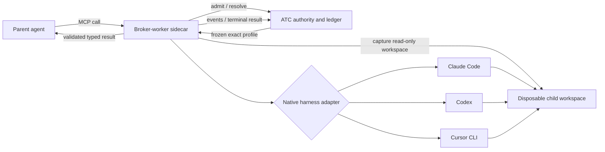

# Agent Execution Broker Design

**Status:** Approved for implementation on 2026-07-29.

## Objective

Add a node-scoped execution broker that lets an agent synchronously request a
fresh, isolated second opinion from any deployment-supported agent harness.
The first vertical slice exposes two MCP tools:

- `request_review`, for static review of an exact repository change; and
- `consult_agent`, for a structured answer grounded in explicitly supplied
  context.

The broker provides the observable and repeatable part of subagent-driven
development without inheriting a parent transcript, coupling callers to model
providers, or routing model data through ATC. It supports Claude Code, Codex,
and Cursor CLI behind one fixed contract.

This work implements roadmap item 13's execution control plane. It does not
replace the durable, writable child-execution design needed for delegated
implementation work.

## Product Contract

### Fresh context

Every child starts with only:

1. the broker's fixed, versioned instructions for the selected tool;
2. the caller-supplied prompt or question; and
3. the caller-selected logical attachments.

The parent transcript, parent harness settings, local user configuration,
undeclared files, and parent MCP servers are not inherited. Empty context is a
valid and useful choice.

### Synchronous calls and caller-controlled concurrency

Each MCP call blocks until the child reaches a terminal state or its deadline.
A parent may issue any number of calls concurrently. The broker adds no
artificial parallelism limit; admission, provider quotas, pod resources, and
workflow budgets remain visible constraints rather than hidden scheduling.

Progress notifications report the durable child execution ID and coarse
phase. Disconnecting the MCP client does not erase the ATC execution record.
The initial MCP response cannot be resumed after a caller disconnect; callers
may retrieve the terminal execution by ID through the ATC inspection surface.

### Agent-facing selection

Callers select capability rather than provider or model:

```yaml
tier: economy | balanced | frontier
effort: medium | high
```

The node-scoped catalog lists only supported combinations and describes their
intended use. Nodes may expose different subsets. Provider names, model names,
and harness brands do not appear in the MCP input contract.

Resolution is exact and deterministic. A frozen workflow admission maps
`(tool, tier, effort)` to one operator profile. There is no runtime model
router, provider fallback, or harness-preference heuristic.

### `request_review`

Input:

```json
{
  "tier": "balanced",
  "effort": "high",
  "instructions": "Focus on authorization boundaries.",
  "attachments": ["workspace", "validation"]
}
```

`workspace` is required and names a verified capture of the caller's current
Git workspace. Other attachment names resolve only through node-bound sealed
inputs or records. Raw filesystem paths, snapshot IDs, URLs, and arbitrary
mounts are not accepted.

The result is a sealed `review/v1` body with conclusion, summary, findings, and
evidence anchors. The broker marks it as a **static review** and records that
tests were not run. Reviewers may inspect a supplied `validation/v1` record as
evidence, but cannot create authoritative validation.

### `consult_agent`

Input:

```json
{
  "tier": "frontier",
  "effort": "medium",
  "question": "Which compatibility risk is most likely?",
  "context": "The v2 endpoint remains enabled for one release.",
  "attachments": ["design", "api-contract"]
}
```

The result is a sealed `consultation/v1` record containing:

- `answer`;
- `claims`, each with optional evidence anchors;
- `assumptions`;
- `uncertainties`; and
- `recommendations`.

The contract is intentionally fixed across harnesses. Harness-native prose is
never returned as a successful typed result.

### Common terminal result

Both tools return:

- child execution ID;
- requested neutral selector;
- exact resolved operator profile identity;
- sealed result snapshot reference;
- validated result body;
- terminal status;
- duration; and
- cost or token fields when the harness reports them.

Unavailable accounting fields remain absent. The broker does not estimate
provider cost and label it as observed.

## Architecture



### Broker-worker sidecar

The trusted broker-worker is a managed sidecar in the parent agent pod. It:

- exposes the MCP tools over loopback;
- mounts the parent workspace read-only;
- captures and materializes selected inputs;
- owns a separate writable scratch volume for native harness state;
- invokes the selected native harness;
- normalizes harness events and accounting;
- validates the fixed output contract;
- asks the ordinary server-side snapshot machinery to seal the result; and
- streams progress and returns the terminal result.

The sidecar does not let a child modify the parent workspace. A child may write
only inside its disposable materialization when its harness requires local
state. The initial tools are observational, so those writes are discarded.

The sidecar is managed platform infrastructure, not an authored schema-v3
sidecar or a generic capability. Workflow authors cannot replace its image,
mounts, authority, fixed instructions, or ATC endpoint.

### ATC authority and ledger

ATC owns the narrow control plane:

- admission against the frozen node-scoped profile catalog;
- idempotent child execution creation;
- authoritative verification of exact resolution;
- lifecycle, transcript-event, accounting, provenance, and result persistence;
- result snapshot sealing/ownership;
- terminal retrieval; and
- reconciliation of abandoned executions after pod loss.

ATC neither invokes harness binaries nor proxies prompts and model responses.
The model data plane remains between the broker-worker and the selected
provider.

### Why not a standalone broker service

The sidecar placement makes exact workspace capture simple and avoids uploading
working trees to a central service. The ATC ledger makes admission and
provenance authoritative without giving ATC filesystem or provider-data-plane
responsibilities. A standalone service can be introduced later without
changing the tool contract if cross-pod execution becomes necessary.

## Exact Profile Catalog

There are two catalog views.

### Agent-visible catalog

The MCP tool descriptions and a read-only MCP resource expose entries such as:

```yaml
- tier: balanced
  effort: high
  tools: [request_review, consult_agent]
  purpose: careful general review and analysis
```

This catalog is guidance as well as policy. Unsupported combinations fail
before workspace capture.

### Operator profile

Each visible entry resolves to a frozen operator profile containing:

- immutable profile ID and revision;
- broker-worker image digest;
- adapter name and version;
- harness binary name and exact version requirement;
- provider and exact model identifier;
- native effort mapping;
- fixed tool-instruction digest;
- credential slot;
- timeout and budget ceiling;
- data policy and network policy identity;
- supported tool and output-contract revisions; and
- enforceable harness capabilities and restrictions.

Workflow admission copies the visible selector subset and exact mappings into
the immutable workflow revision. Catalog changes affect only newly admitted
workflow revisions. The broker sends the selected frozen profile identity to
ATC; ATC rejects any mismatch before execution begins.

The first release uses deployment-managed static configuration. Runtime
catalog CRUD and live profile mutation are deferred.

## Native Harness Adapters

The existing `agent/provider.Adapter` remains the low-level primary-agent
session seam. The broker adds a separate, execution-oriented adapter contract
because child executions require exact command construction, event
normalization, typed final-output handling, capability reporting, and observed
accounting.

Every adapter implements:

- `Identity` and detected harness version;
- `ValidateProfile`;
- `BuildInvocation`;
- `Start`;
- normalized progress/event decoding;
- terminal output extraction;
- observed usage extraction; and
- cancellation with process-tree cleanup.

The broker never shells through an interpolated command string. Arguments,
environment names, working directory, and credential slot are separately
constructed and redacted in provenance.

### Codex

Codex runs non-interactively with an ephemeral session, ignored user
configuration/rules, read-only sandbox, no approvals, JSONL events, and an
output JSON Schema. The adapter maps neutral effort to the native reasoning
effort and records the exact model and CLI version.

### Claude Code

Claude Code runs in print mode with stream JSON, an exact model, explicit tool
allow/deny policy, no inherited MCP configuration, a bounded turn count, and
the most restrictive supported permission mode. Where the installed version
supports native JSON Schema output, the adapter uses it; server validation
remains authoritative in all cases.

### Cursor CLI

Cursor CLI runs in print mode with stream JSON and an exact model. It does not
receive `--force`; child changes therefore remain proposals even inside the
disposable workspace. Because its documented CLI contract does not currently
guarantee schema-constrained final output or terminal-tool denial, the adapter
reports those limitations honestly. The broker still performs strict terminal
validation, and the pod/network/workspace boundary supplies the authoritative
isolation.

Profiles are admitted only when the installed harness version supports their
declared controls. A missing binary, incompatible version, or unsupported
capability is an admission/preflight error, not a best-effort downgrade.

## Workspace Capture

`request_review` does not require a commit. It requires a Git worktree and
normalizes the current state into a verified `repository-change/v1` record:

1. resolve the sealed `repository/v1` base and verify its commit/tree;
2. inventory tracked, staged, deleted, and nonignored untracked files;
3. create a temporary index without modifying the caller's index;
4. add the complete desired workspace state to that index;
5. write the result tree;
6. produce a binary-safe full-index patch from base tree to result tree;
7. apply the patch in a clean temporary checkout and verify the same tree; and
8. restat captured files and retry when the workspace changed during capture.

Ignored files, `.git` internals, sockets, devices, and files outside the
worktree are excluded. Symlinks are captured as Git symlinks and never
followed. Submodule gitlinks are recorded without traversing submodule
worktrees. Oversized captures fail against an explicit profile limit.

After a bounded number of stability retries, mutation produces a retryable
`workspace_unstable` error. The result record binds the base commit, base tree,
result tree, patch digest, capture policy revision, and repository identity.

The child receives a clean base checkout plus the verified patch, not a live
mount of the parent workspace.

## Credentials and Isolation

The first release assumes one deployment-managed shared provider credential
per credential slot. Profiles name the slot, never the secret. A
`CredentialResolver` supplies the slot to the trusted broker sidecar through a
managed secret projection.

Secrets are excluded from:

- child prompts;
- command provenance;
- environment dumps;
- transcript events;
- result records; and
- MCP errors.

Children receive no broker MCP endpoint, publisher authority, Kubernetes
credentials, generic dev MCP, or authoritative validation capability. Static
reviewers cannot run the repository's test suite through a platform tool. The
pod sandbox and read-only materialization are authoritative; fixed
instructions reinforce the product contract and are recorded by digest.

## Durable Execution Model

`agent_child_executions` is a distinct ledger from primary
`agent_run_attempts`. A record contains:

- UUID and team/workflow/run/node identity;
- tool and idempotency key;
- requested selector;
- frozen profile ID/revision/digest;
- input attachment identities and prompt digest;
- status and coarse phase;
- broker instance and attempt;
- timestamps/deadline;
- normalized usage and duration;
- transcript/event object reference;
- result snapshot identity; and
- structured terminal error.

States are:

`pending -> admitted -> capturing -> running -> validating -> sealing -> succeeded`

and may terminalize as `errored`, `cancelled`, or `timed_out`.

The creation operation is idempotent within the parent node attempt. Reusing an
idempotency key with different normalized input fails closed. Only ATC may
transition or terminalize records; broker updates use an execution-scoped,
short-lived authority and monotonic sequence numbers.

ATC reconciliation marks a nonterminal execution abandoned after its lease
expires. Automatic native-session resume is deferred; a later retry creates a
new broker attempt on the same child execution only when no ambiguous external
effect is possible.

## Output Validation and Sealing

The tool-specific JSON Schema is sent to harnesses that support it. All
harnesses must place one candidate JSON document in the broker's terminal
output channel. The broker:

1. parses exactly one document with duplicate-key rejection;
2. validates the fixed schema and size limits;
3. validates every evidence anchor against declared subjects;
4. injects server-derived subject and execution provenance;
5. sends the candidate to ATC's ordinary authoritative snapshot validator and
   sealer; and
6. records the resulting snapshot identity before success.

Malformed or semantically invalid output terminalizes the child as
`output_invalid`. Raw prose is retained only in the protected transcript and
is never returned as a successful typed body.

## Failure Semantics

Stable error codes include:

- `selector_unsupported`;
- `profile_mismatch`;
- `attachment_unknown`;
- `workspace_not_git`;
- `workspace_unstable`;
- `capture_too_large`;
- `harness_unavailable`;
- `harness_incompatible`;
- `credential_unavailable`;
- `provider_rejected`;
- `deadline_exceeded`;
- `output_invalid`;
- `sealing_failed`; and
- `broker_lost`.

Errors returned to the parent contain the child execution ID, retryability,
safe summary, and ATC inspection reference. Provider bodies, credentials,
unredacted commands, and undeclared file contents are not included.

## Observability

ATC and the broker emit metrics by tool, neutral selector, operator profile,
harness, terminal status, and coarse failure code. Provider/model labels are
operator-only to keep the agent-facing abstraction neutral.

The execution inspection view shows:

- exact frozen resolution;
- fixed instruction and adapter digests;
- input and result snapshot identities;
- normalized timeline;
- static-review/tests-not-run notice;
- observed tokens/cost when available; and
- transcript access subject to ordinary team authorization and retention.

No prompt or response content is placed in metrics or ordinary logs.

## Rollout and Compatibility

The broker is disabled by default and enabled per deployment. Rollout order:

1. database ledger and read-only ATC inspection;
2. profile parsing/admission and harness preflight;
3. `consult_agent` with one canary profile per adapter;
4. workspace capture and `request_review`;
5. managed sidecar injection for selected nodes;
6. all configured profiles.

An unavailable profile makes its selector absent at admission. Existing frozen
workflow revisions remain interpretable even after a deployment catalog
changes. Disabling execution rejects new calls and leaves existing records
inspectable.

## Verification

Implementation uses red-green-refactor tests and must demonstrate:

- fresh and previous-head database migration paths;
- exact, immutable selector resolution and cross-team denial;
- idempotent creation and monotonic lifecycle updates;
- dirty/staged/deleted/untracked/binary/symlink workspace capture;
- mutation detection and result-tree rederivation;
- contract fixtures for all three harness event streams;
- exact argv/environment redaction and version/capability preflight;
- cancellation, timeout, process cleanup, and broker-loss reconciliation;
- strict `review/v1` and `consultation/v1` validation;
- rejection of prose, duplicate JSON keys, invalid anchors, and oversized
  output;
- no parent transcript, parent MCP, user config, or undeclared attachment
  inheritance;
- static-review/tests-not-run provenance;
- concurrent synchronous calls without broker serialization;
- managed-sidecar trust and secret non-disclosure;
- ATC integration, Fly inspection, Helm rendering, and focused Kubernetes
  behavior.

Live-provider tests are opt-in and credential-gated. Fixture-based adapter
tests are authoritative for ordinary CI.

## Deferred Work

- writable `delegate_task`;
- before/after snapshot ownership for shared writable workspaces;
- asynchronous MCP submit/poll/cancel tools;
- native-session resume;
- recursive broker access;
- dynamic profile administration;
- automatic provider fallback or routing;
- per-user provider credentials;
- remote standalone workers;
- harness-driven authoritative validation; and
- provider-cost estimation when not reported.

## Decision Record

1. Use a broker-worker sidecar plus a thin ATC authority/ledger.
2. Ship `request_review` and `consult_agent`; defer writable delegation.
3. Keep each MCP call synchronous and permit unconstrained caller concurrency.
4. Offer `economy`, `balanced`, and `frontier` with `medium` and `high`
   effort, mapped deterministically by a frozen node catalog.
5. Support Claude Code, Codex, and Cursor CLI in the first vertical slice.
6. Accept logical attachments only and inherit no parent transcript.
7. Capture dirty Git workspaces as verified `repository-change/v1`; commits are
   not required.
8. Make review static-only, with tests explicitly recorded as not run.
9. Use a shared credential behind a credential-slot abstraction initially.
10. Validate one fixed typed contract and fail closed on malformed harness
    output.
11. Treat CLI restrictions as adapter capabilities; rely on managed pod,
    filesystem, and network boundaries for authoritative isolation.
12. Keep ATC off the provider data plane.
