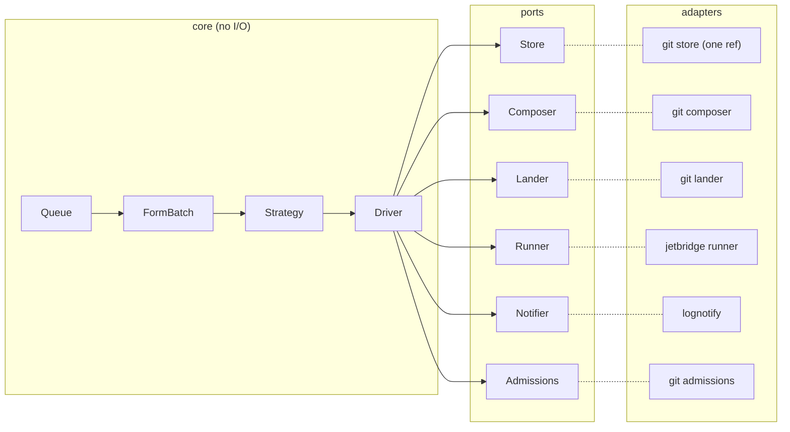
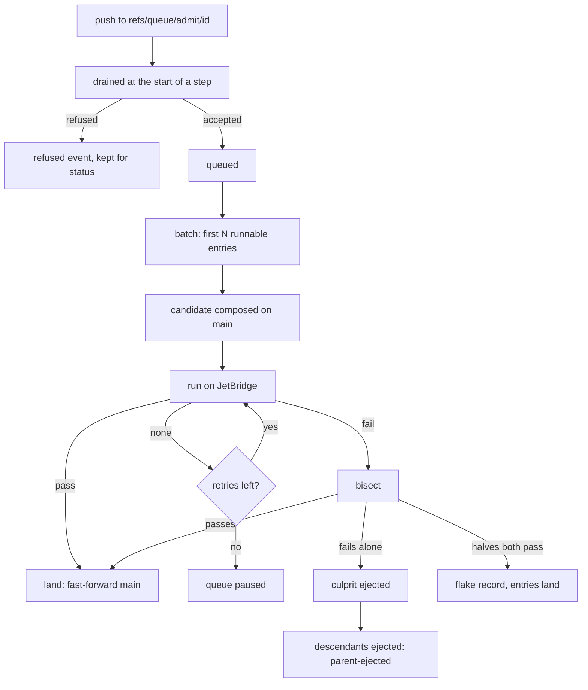
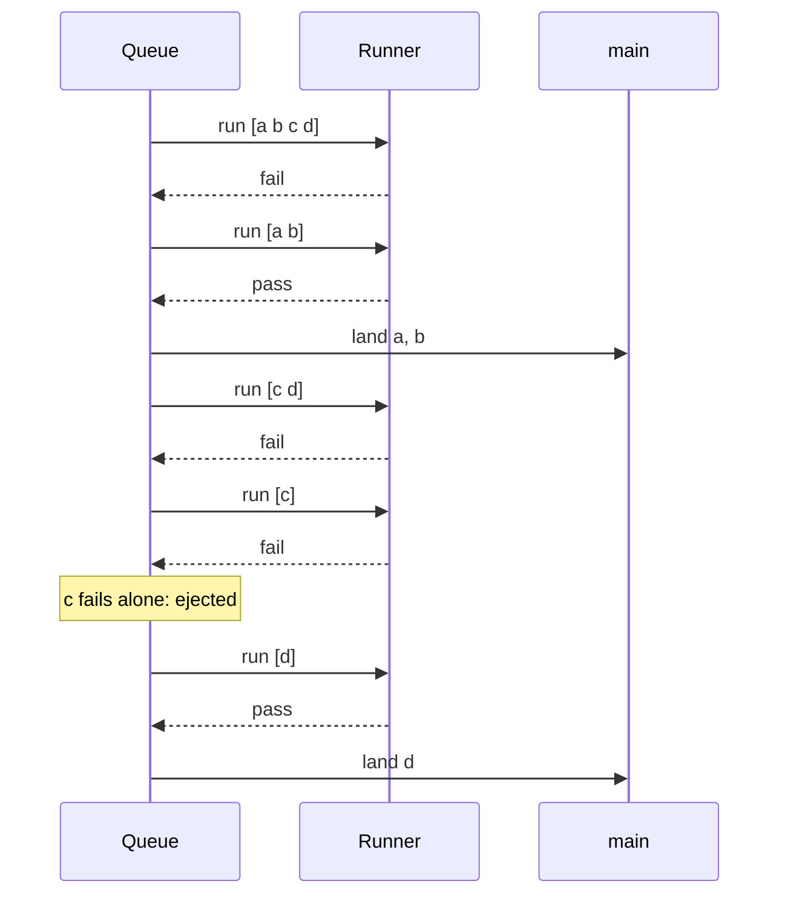

# queue

A config-defined merge queue for JetBridge. It tests changes together on a
candidate branch and lands them fast-forward onto main. A pure core decides;
git, JetBridge and notification sit behind ports, supplied by adapters.

`queue/` is its own Go module and imports nothing from the rest of the repo.
Vocabulary is in [CONTEXT.md](CONTEXT.md); behaviour is specified in
[features/](features/).

## Guarantees

- main only moves by fast-forward to a candidate that went green. The Lander
  refuses if main moved since the candidate was composed.
- Blame is proven by bisect, never guessed. A change is ejected only when it
  fails on its own (or, as a batch of one, fails to compose).
- A confirmed culprit is ejected with no automatic requeue. An ejected id is
  never admitted again; a fixed change is admitted under a new id.
- A missing verdict (poll error, no result inside `runner.wait_cap`, compose
  error that names no entry) means retry, then pause. It never ejects.
- Flakes are surfaced, never hidden: a red batch whose halves both pass lands,
  is announced as a `flaky` event, and is kept as one settle record (kind
  `flaky`, naming every entry of the batch) that `status`, `stats` and `view`
  show. `flakes` counts flaky batches, not entries.
- Stacked changes (one built on another queued change) are always tested with
  their parents. A descendant of an ejected change is ejected, unrun, with
  cause `parent-ejected` and the ejected ancestor named.
- A change built on a merge of two queued changes that do not build on each
  other is refused at admission, with the reason.
- One owner at a time: a lease with a growing token, and a fence on every land.
  Landing is crash-safe: an intent is saved before the land and reconciled
  against main on the next load.

## Architecture



The Strategy reads a View and returns runs to start and settlements; it never
writes the queue or lands. The Driver carries them out through the ports, saves
before each run and after each settlement, and does nothing without the lease.

## Life of a change



Only the culprit and its descendants leave the queue; the rest of the batch
lands, and the ref under `refs/queue/admit/` is deleted once the change is saved.

## Bisect example

A batch of four, `a b c d`, where only `c` is broken. Each pass composes on the
main that already holds what landed so far.



## Quick start

```
cd queue && go build ./cmd/queue
```

1. Write a config (see [example/](example/)). `repository.uri` is required and
   never guessed.
2. Give the runner a JetBridge pipeline whose resource follows the candidate
   branch and whose job tests it.
3. Start the queue: `queue run --config queue.yaml` (`--every 5s` between
   steps, `--once` for a single step).
4. Admit a change from a clone that has the commit:
   `queue admit --config queue.yaml <id> <sha>`, or
   `git push origin <sha>:refs/queue/admit/<id>`.
5. Read state, all read-only (they load the state ref and never take the lease):
   - `queue status` prints JSON: `Queued`, `InFlight`, `Landed`, `Ejected`
     (each with `Why`, `Cause`, `At`), `Paused`, `Why`, the latest `Refused`
     and the latest 10 `Flakes` (flaky batches).
   - `queue stats [--window 1h]` prints a fixed set of numbers over the window:
     `queued`, `in_flight`, `paused`, `paused_why` (these four are the queue
     now), `landed`, `admitted`, `ejected` (`culprit`, `parent_ejected`,
     `refused`, `other`), `flakes` (flaky batches), `median_queue_seconds`,
     `p90_queue_seconds`, `landed_per_hour`. It counts the settle records kept,
     at most the latest 1000.
   - `queue view` prints the panel's `view/v1` JSON (testing, queued, landed,
     ejected, a paused banner, flakes with their reason), over a one-hour
     window. The visual panel ships later with the resource-views feature.
6. Resume a paused queue: `queue resume --config queue.yaml` (see Pause).

Exit codes: 0 done, 2 admission refused (unsafe id), 1 anything else.

## Configuration

Strict YAML: an unknown key is refused, naming the nearest valid one. Aliases
and merge keys are refused. Defaults are applied before your file is read.

| Key | Default | Notes |
|---|---|---|
| `apiVersion` | none | Required: `jetbridge.dev/queue/v2`. |
| `repository.uri` | none | Required. Remote that holds main, the candidate, and all queue refs. Must not hold credentials (see Credentials). |
| `repository.main` | `core` | Branch that runs compose on and land to. |
| `repository.candidate` | `queue-next` | Scratch branch, force-pushed by the queue. Must differ from main. |
| `admission.source` | `refs` | The only value. |
| `admission.prefix` | `refs/queue/admit/` | Ref prefix ending in `/`. Must not overlap any ref the queue owns. |
| `admission.control_prefix` | `refs/queue/control/` | Ref prefix ending in `/` for operator requests; `queue resume` writes `<prefix>resume-<PauseSeq>`. Same overlap rule. |
| `batch.max` | `4` | Largest batch; at least 1. |
| `batch.retry_none` | `1` | Retries on no verdict before pausing; at least 0. |
| `batch.strategy` | `serial` | The only value: one batch at a time, bisecting a red batch by halves. |
| `batch.adaptive` | off | `{start, min, grow_after}`. Batches start at `start`, halve (floor `min`) after a red batch, double (cap `batch.max`) after `grow_after` green batches in a row. Needs `1 <= min <= start <= max`, `grow_after >= 1`. Size resets to `start` on reload. |
| `compose.committer.name` | `merge-queue` | Author and committer of composed commits; one squashed commit per change, titled `land(<id>)`. |
| `compose.committer.email` | `merge-queue@localhost` | |
| `runner.kind` | none | Required: `jetbridge`. |
| `runner.url` | none | Required. Base URL of the JetBridge web node. Must not hold credentials. |
| `runner.team` | `main` | |
| `runner.pipeline` | none | Required. |
| `runner.job` | none | Required. The job that tests the candidate. |
| `runner.resource` | none | Required. The resource the job gets the candidate from. |
| `runner.credential` | none | Required. `env:NAME` or `file:PATH`; holds a bearer token, read on every call. |
| `runner.wait_cap` | `1h` | A build not done by then is no verdict. |
| `lander.max_failures` | `3` | Land errors in a row before the queue pauses; at least 1. Landing is always fast-forward only. |
| `lander.lease_ref` | `refs/queue/lease` | Ref that holds the fence. |
| `lander.scratch` | OS temp dir | Parent of the lander's private bare repo. |
| `notify.kind` | none (no notifier) | `log`. |
| `notify.path` | none | Required for `log`: a file (appended) or `-` for stdout. |
| `store.ref` | `refs/queue/state` | The one ref holding queue state and the lease. |

## Operating notes

- **Pause.** The queue pauses after `batch.retry_none` retries on no verdict, or
  after `lander.max_failures` land errors in a row. `status` shows `Paused` and
  `Why`. A paused queue still drains admissions and polls runs; it starts none.
  Each pause has a number (`PauseSeq`, counted up on every pause). `queue resume`
  reads it from the saved state and pushes main's current sha to
  `<admission.control_prefix>resume-<PauseSeq>`; the running queue clears that
  pause on its next step, announces `resumed`, and deletes the request. A request
  for any other pause, or on a queue that is not paused, is logged, deleted and
  changes nothing.
- **Lease.** One lease, held in `store.ref`, for a minute, renewed on each step.
  A second `queue run` fails with "lease held by ..." until it expires. Every
  save carries the token, and every land carries a higher fence written to
  `lander.lease_ref` in the same atomic push as main, so a stalled former
  holder cannot move main.
- **Crash.** State is saved before each run, before each land and after each
  settlement. On restart a saved landing is settled by asking whether main
  already holds the candidate; if that cannot be read, the queue pauses. Runs in
  flight are dropped and their entries rerun.
- **Admit-ref ids.** One ref component: letters, digits, `_` and `-`, starting
  with a letter or digit, at most 100 characters. An id that was ever queued is
  refused for a different commit, and a settled id is never admitted again. The
  ref is deleted only if it still points at the commit that was saved.
- **Refusals.** A refused change is not queued; the latest 20 are kept in
  `status` and announced as `refused`.
- **Settle records.** Every land, eject, pause, refusal and flake is also saved
  in the queue state as a record (the latest 1000) with its id, commit, kind,
  time, admission time, reason, cause, run and batch. `status`, `stats` and
  `view` read them, so they survive a restart.
- **Events.** With `notify.kind: log`, one JSON line per event: `batch-started`,
  `verdict`, `landed`, `ejected`, `flaky`, `paused`, `resumed`, `refused`, with
  `time`, `entries`, `run`, `why`, `cause`, `parent`. A notifier error is logged
  and never changes a decision. With no notifier, nothing is announced.
- **Credentials.** No URL carries one. Every string in the config file, keys
  included and checked as decoded (so a `!!binary` tag hides nothing), and every
  command-line argument is refused at load if it is a
  `scheme://` value holding `user:password@` or a bare `user@` in its authority
  (only an `ssh://` login name such as `ssh://git@host/repo` is allowed; an `@`
  in the path, as in `file:///srv/a@b.git`, is not userinfo), or if it does not
  parse. A `scheme://` inside free text, as in `Queue (https://ci.example.test)`,
  is refused only if its authority holds an `@`. The refusal names the key path,
  never the value. Git authenticates the way it does outside the queue:
  an ssh key, a credential helper or `GIT_ASKPASS` in the runner's environment.
  The runner's bearer token comes only from `runner.credential` and is sent in a
  header. A URL error from the runner names the setting or the request path and
  the cause, never the URL; a `runner.url` that does not parse is reported as such, with no detail.
- **Redaction.** Every output line, saved reason, event and log passes through
  one filter. It hides the runner's token by value in every encoding: raw,
  URL-escaped, JSON-escaped (once or twice, with or without escaped slashes) and
  quoted. Any other URL's userinfo is hidden by a best-effort pattern that stops
  at whitespace and `/ ? # " \ ' ,`, so nearby text is not mangled. Saved state
  is redacted by field: only free text (the pause reason, and each settle
  record's and refusal's reason and cause). Ids, commits, refs and the
  dependency and ejection maps are never changed, so a reload decides the same.
- **Runner.** The pin is per resource, so one run is in flight at a time; a new
  run aborts and unpins the previous one. The candidate must be reachable by the
  resource's configured branch.

## Limits and not in v1

- Side-lane: not in v1. `serial` is the only strategy.
- Hint-ranked bisect: not in v1. Every bisect is plain halves.
- Panel: `queue view` emits the view JSON; the visual panel ships later with
  the resource-views feature.
- Record notifier: not in this change. It needs an append route from a separate
  record feature; events go to a log line only.
- `github-pr` admission is not supported; changes arrive as pushed refs.
